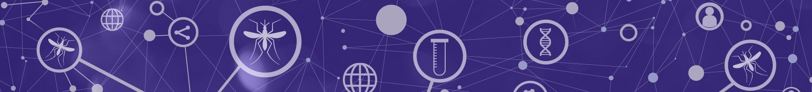

***Training course in data analysis for genomic surveillance of African malaria vectors***

---

# Home

Welcome to this training course on data analysis for genomic surveillance of African malaria vectors, developed jointly by [MalariaGEN](https://www.malariagen.net) and [PAMCA](https://www.pamca.org). 

## Workshop programme

The course will consist of a series of workshops. The workshop programme is as follows:

* {doc}`workshop-1/about`
* {doc}`workshop-2/about`
* {doc}`workshop-3/about`
* {doc}`workshop-4/about`
* {doc}`workshop-5/about`
* {doc}`workshop-6/about`
* {doc}`workshop-7/about`
* {doc}`workshop-8/about`

## Data access

Vector Observatory data are stored in Google Cloud Storage (GCS) in the US region. The current set-up requires users to request access and authenticate prior to accessing data. 

A summary of the process to access the data and authenticate can be found here:

* {doc}`general/data-access`

## Context and motivation

The main motivation for this course, and for the ongoing work by MalariaGEN and PAMCA to develop capacity for *Anopheles* genomics, comes from the current situation in malaria control in Africa. This situation is well described in the [WHO World Malaria Report 2021](https://www.who.int/teams/global-malaria-programme/reports/world-malaria-report-2021) and in the [WHO Global Technical Strategy for Malaria 2016-2030](https://www.who.int/publications/i/item/9789240031357), but here are some key highlights.

### Progress towards malaria elimination has stalled

Between 2000 and 2015, the incidence and mortality rates for malaria in Africa reduced substantially, primarily due to the scaling up of vector control interventions using long-lasting insecticidal nets (LLINs) and indoor residual spraying (IRS). However, since 2015, neither incidence nor mortality have reduced substantially. 

### Biological threats to the efficacy of malaria vector control

The reasons for this stalling in progress are complex and not fully understood, but there are some current biological threats which are playing a part. In particular, resistance to insecticides is now widespread among the *Anopheles* mosquitoes which primarily transmit malaria in Africa. 

### Malaria vector control is changing

Malaria vector control programmes are responding to the threat of insecticide resistance by deploying new LLIN products which combine a pyrethroid insecticide either with the synergist piperonyl butoxide (pyrethroid-PBO LLINs) or with a second insecticide with a different mode of action (dual active LLINs). New IRS products are also being used which introduce insecticides not previously used in public health. These new LLIN and IRS products are already being deployed at scale.

These are the biggest changes in malaria control in at least a decade. These new vector control tools are known to be highly effective now, but we know from past experience that malaria vector populations will evolve new forms of resistance in response to these new selective pressures. Without a capability to detect these new biological threats, these new tools will not remain effective for long.

### Surveillance as a core intervention

Different countries face different malaria control challenges and threats, and the consensus is that there is no "one size fits all" approach to malaria vector control. Rather, vector control strategy needs to be tailored based on the local situation. Gathering of data on malaria vector populations (vector surveillance) thus has a key role to play in guiding decisions about vector control. In order to make this a reality, there is a need for strengthened national capacity to generate, analyse and use high-quality surveillance data.

### Genomic surveillance

Malaria vector surveillance needs to gather and integrate data from a variety of different sources. Vector genomics has a potential role to play in generating a new source of data, complementing and adding new insights when brought together with existing surveillance data on intervention coverage, vector bionomics and insecticide resistance phenotypes. 

To understand the potential value of vector genomic surveillance, a useful parallel is consider the role that genomic surveillance has played in responding to the COVID-19 pandemic. Although COVID-19 and malaria are very different diseases, they share something in common, which is that evolution leads to the emergence of new biological threats, and early detection of those threats can be valuable. In the case of COVID-19, early detection of highly-transmissible variants *alpha*, *delta* and *omicron* helped alert public health authorities that action needed to be taken sooner rather than later. 

By analogy, vector genomic surveillance could enable early detection of new insecticide resistance variants emerging in malaria vector populations in response to deployment of new LLIN or IRS products, which in turn could be beneficial in designing and adapting insecticide resistance management plans. 

## Intended audience

The primary audience for this training course is scientists and data analysts in African research groups and disease control programmes who are collaborating with MalariaGEN and PAMCA to generate *Anopheles* genomic data, and who want to use the data to answer questions about malaria vector surveillance. E.g., if vector control strategy has recently changed in a given country or region, what impact has that had on the local vector populations?

We hope this training course will also be useful to a broader audience including anyone who is interested in learning more about genomic data and how it could be used for vector surveillance.

## Learning objectives

At the end of this course, you will be able to:

1. Perform a range of analyses of *Anopheles* genomic data that are relevant to malaria vector surveillance.
1. Generate plots, tables and statistics that can be used in a surveillance report.
1. Interpret your results and explain to others what they mean.

## Prerequisites

This is a hands-on training course involving the analysis of real genetic data. To follow this course you will need to have some prior experience of data analysis using a programming language such as Python, R, Julia, Matlab or Stata. The practical exercises in each workshop will use the Python programming language, and some prior experience of Python will be advantageous, but is not required.

During the practical sessions in each workshop we will use [Google Colaboratory](https://colab.research.google.com/) (a.k.a. Colab), which is an interactive cloud computing service provided for free by Google. In order to use Colab you will need to have a Google user account. If you do not already have a Google user account, please make sure to create one before you start the course.
